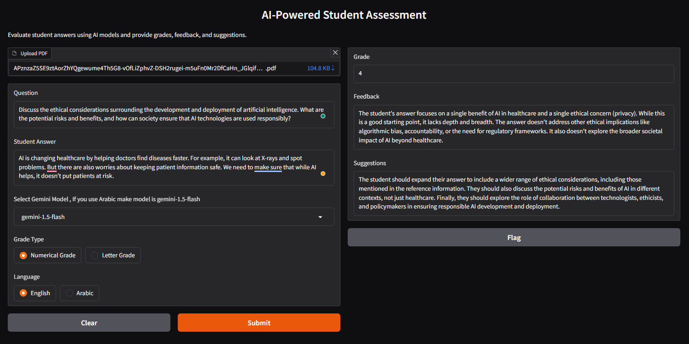
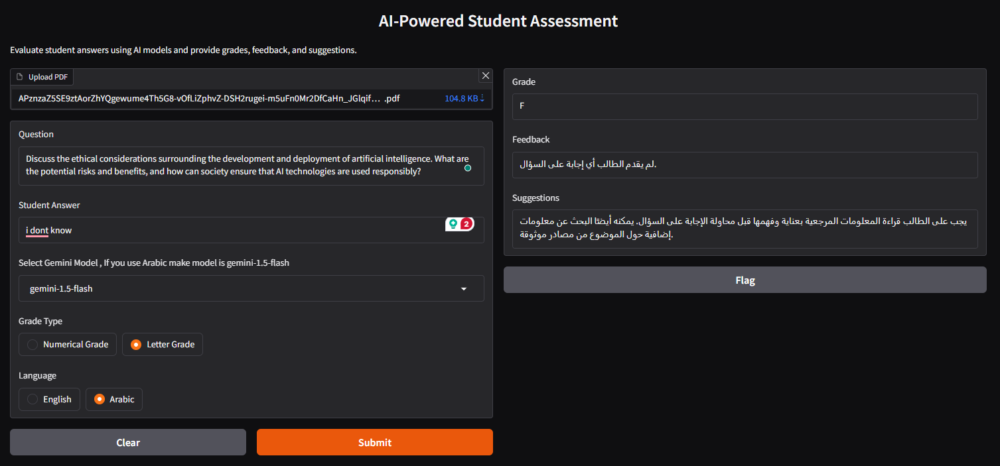

# AI-Powered Student Assessment 🎓

An intelligent system that leverages AI to evaluate student answers, provide detailed feedback, and offer improvement suggestions. The system uses Google's Gemini models and document embeddings to provide context-aware assessment of student responses.

[](https://www.python.org/downloads/)
[](https://python.langchain.com/)
[](https://gradio.app/)

## 📸 Project Screenshots

### Example Assessment with Numerical Grade

*The main interface where users can upload PDFs, input questions, and student answers*

### Example Assessment Arabic Language

*An example of the system's output showing grades, feedback, and suggestions with Arabic Language*


## 🌟 Features

- PDF document processing for reference materials
- Context-aware answer evaluation
- Automatic grading (numerical and letter grades)
- Detailed feedback generation
- Improvement suggestions
- Support for multiple languages (English and Arabic)
- User-friendly web interface
- Multiple Gemini model options

## 🛠️ Installation

1. Clone this repository:
```bash
git clone https://github.com/yourusername/ai-powered-student-assessment.git
cd ai-powered-student-assessment
```

2. Install the required packages:
```bash
pip install -U langchain_community tiktoken faiss-cpu langchain langchainhub
pip install sentence_transformers BeautifulSoup4 pypdf
pip install langchain-huggingface
pip install --upgrade langchain langchain-google
pip install langchain_google_genai google-generativeai
pip install gradio
```

## 🔑 Setup

1. You'll need to set up your Google API key for Gemini models:
```python
# Replace with your actual API key
google_api_key = "your_api_key_here"
```

2. The system uses the following key components:
- HuggingFace Embeddings (all-MiniLM-L6-v2)
- FAISS vector store for efficient similarity search
- LangChain for document processing and chain operations
- Gradio for the web interface

## 💻 Usage

### Running the Application

1. Load the notebook in Google Colab or your local Jupyter environment
2. Execute all cells in the initialization section
3. Run the GUI cells to launch the web interface

### Using the Interface

1. **Upload Reference Material**: Upload a PDF containing the reference material for grading
2. **Enter Question**: Input the question given to the student
3. **Enter Student Answer**: Paste the student's response
4. **Select Model**: Choose from available Gemini models:
   - gemini-1.5-flash (recommended for Arabic)
   - gemini-1.0-pro
   - gemini-1.5-pro
5. **Choose Grade Type**: Select between numerical or letter grades
6. **Select Language**: Choose English or Arabic for the evaluation

## 📊 Grading Scale

The system uses the following grading scale:
- A+ : 9-10
- A  : 8-8.9
- B+ : 7-7.9
- B  : 6-6.9
- C+ : 5-5.9
- C  : 4-4.9
- D+ : 3-3.9
- D  : 2-2.9
- F  : 0-2.9

## 🔄 System Architecture

1. **Document Processing**:
   - PDF loading using PyPDFLoader
   - Text splitting using RecursiveCharacterTextSplitter
   - Document embedding using HuggingFace embeddings

2. **Assessment Pipeline**:
   - Context retrieval using FAISS similarity search
   - Question and answer processing
   - AI evaluation using Gemini models
   - Grade and feedback extraction

3. **Output Generation**:
   - Numerical/letter grade
   - Detailed feedback
   - Specific improvement suggestions

## 📋 Example Usage

```python
question = "What is Artificial Intelligence?"
student_answer = "Artificial Intelligence is the simulation of human intelligence in machines..."

# The system will:
# 1. Search reference material for relevant context
# 2. Evaluate the answer against this context
# 3. Provide a grade, detailed feedback, and suggestions for improvement
```

## ⚠️ Important Notes

- For Arabic language assessment, use the gemini-1.5-flash model for best results
- Ensure PDF reference materials are properly formatted and readable
- Large PDFs may take longer to process due to embedding generation
- Internet connection is required for model API calls

## 🤝 Contributing

Contributions are welcome! Please feel free to submit a Pull Request.


## 👥 Authors

- [Abdalla Nassar](https://github.com/AbdallaNassar)

## 🙏 Acknowledgments

- Google for providing access to Gemini models
- The LangChain team for the excellent framework
- Hugging Face for the embedding models
- The Gradio team for the UI framework
